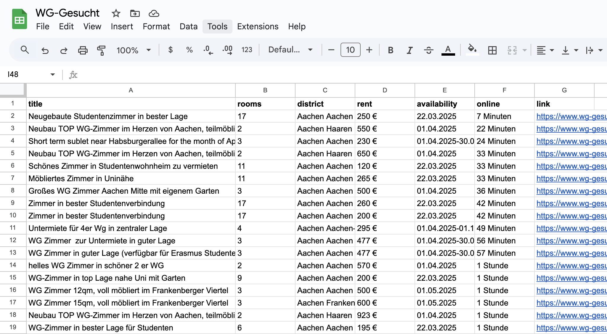

# WG-Gesucht API

A Python-based project that scrapes data from the [WG-Gesucht](https://www.wg-gesucht.de/) website and creates APIs for further use, such as saving data to Google Sheets. This will help users find shared apartments and accommodation in Germany.

## Prerequisite

```bash
$ git clone https://github.com/yunyunyang/wg-gesucht-api.git
$ cd wg-gesucht-api
$ pip install -r requirements.txt
```

## Features

- Scrapes listed rooms from WG-Gesucht by providing a location and relevant data
- Filters partner ads and retrieves room data such as location, price, and availability
- Uses the FastAPI framework to provide APIs
- Provides the feature to store data in Google Sheets

## Enable GoogleSheet API

https://support.google.com/googleapi/answer/6158841?hl=en


## Demos


